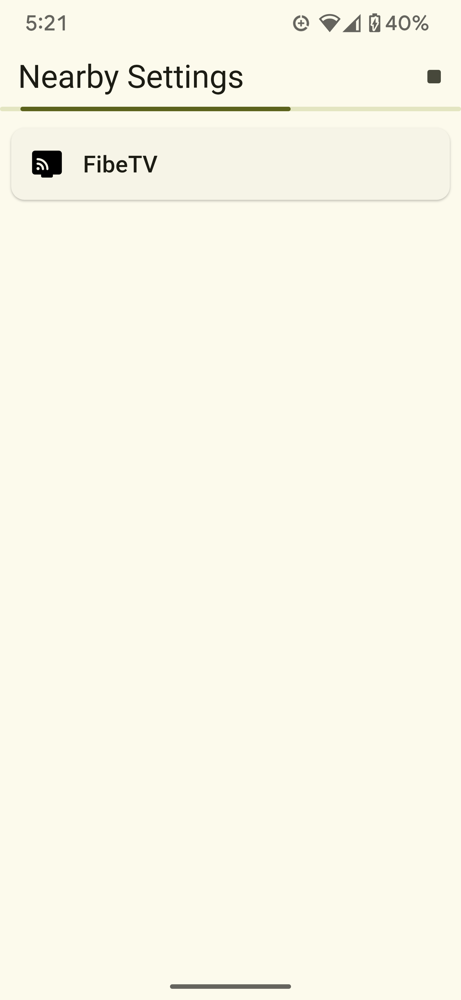
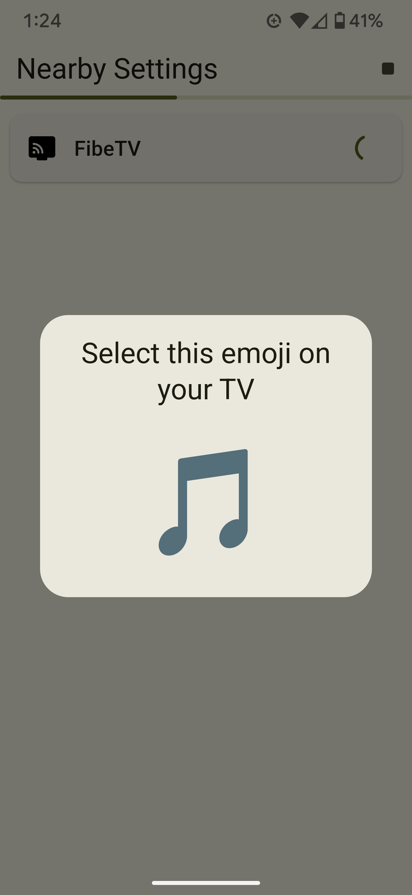
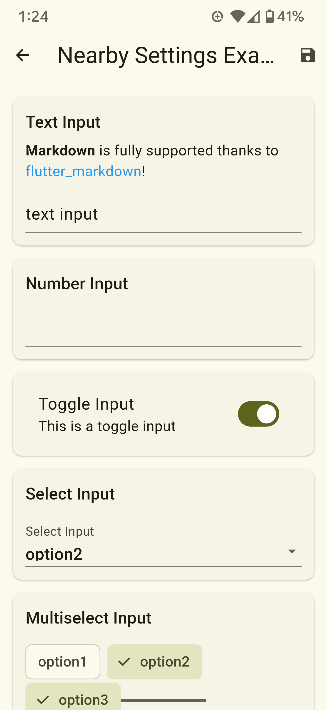
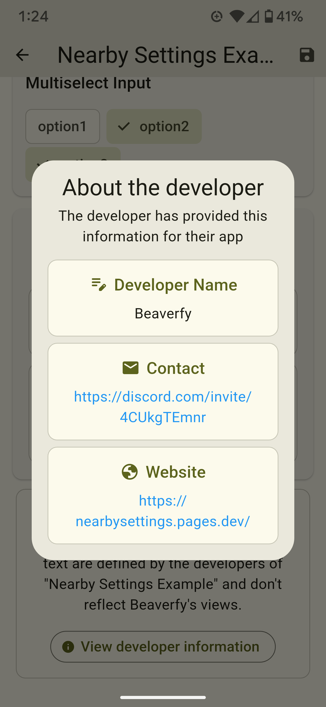

<div align="center">
  
  <h1>Nearby Settings</h1>
  <p>Quickly modify settings on nearby devices</p>
</div>

## Features

- Connect securely to nearby devices
- Modify app settings right from your phone
- Easily define a schema for nearby devices to edit app settings
- Modern Material You design

## Screenshots

<div align="center">

<div style="display: grid; grid-template-columns: repeat(2, 1fr); gap: 10px;">
    
    
    
    
</div>

</div>

## Building from Source

### Prerequisites

- Android Studio
- JDK 21 or higher
- Android SDK 35 or higher

### Steps

1. Clone the repository:
2. Open the project in Android Studio
3. Sync project with Gradle files
4. Build the app:

    ```bash
    ./gradlew assembleDebug
    ```

## License

This project is licensed under the Apache License - see the [LICENSE](LICENSE) file for details.
